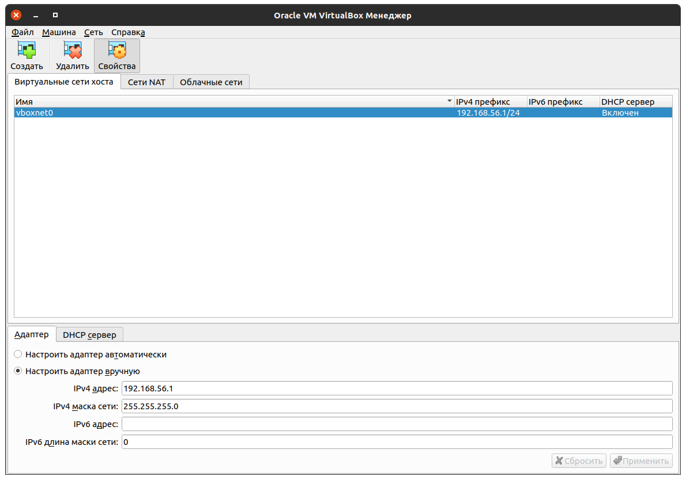

# Настройка виртуальной сети

В **VirtualBox** запускаем менеджер сетей (Меню *Файл* **->** *Инструменты* **->** *Менеджер сетей* или **Ctrl-H**) и проверяем наличие виртуальной сети **vboxnet0**:

<table>
  <tr>
    <th>Параметр</th>
    <th>Значение</th>
  </tr>
  <tr>
    <td>IPv4 адрес</td>
    <td>192.168.56.1</td>
  </tr>
  <tr>
    <td>IPv4 маска сети</td>
    <td>255.255.255.0</td>
  </tr>
</table>

Включать DHCP сервер не обязательно.

[Оглавление](README.md)