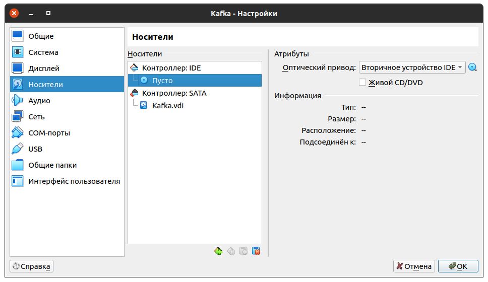
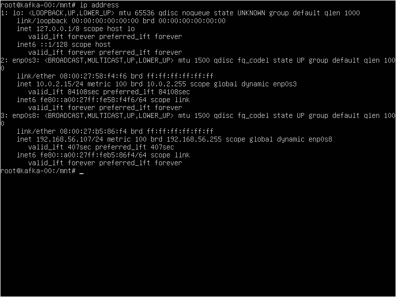

# После установки

## Настройки виртуальной машины
Открываем настройки виртуальной машины и переключаемся а вкладку **Носители**. Убеждаемся, что образ отключен:

## Настройки операционной системы
Запускаем виртуальную машину и логинемся в систему с данными, указанными при установке.

После входа в систему переключаемся в режим работы под администратором: `$ sudo -i`;

Обновляем установленные пакеты:

`# apt-get update`

`# apt-get upgrade`

Устанавливаем дополнительные пакеты: 

`# apt-get install bzip2 gcc make perl iputils-ping default-jre openssh-server`

## Дополнения VirtualBox

Меню **Устройства** - **Подключить образ диска Дополнений гостевой ОС**

Далее в консоли Ubuntu:

`# mount /dev/cdrom /mnt`

`# /mnt/VBoxLinuxAdditions.run`

`# reboot`

## Настройка сети

`$ sudo -i`

`# ip address`

Данная команда выводит настройки сетевых интерфейсов. Нам нужно узнать имена интерфейсов. Например, вывод может быть таким:

Мы видим, что интерфейс **enp0s3** - это NAT (ip адрес 10.0.2.15), а интерфейс **enp0s8** - это сеть **vboxnet0** (ip адрес 192.168.56.107)

Адрес нашей машины с кафкой 192.168.56.107

Проверяем доступна ли наша хостовая машина из виртуалки:

`ping 192.168.56.1`

и доступна ли виртуалка из хостовой машины:

`ping 192.168.56.107`

## OpenSSH

Включаем сервер

`# systemctl enable --now ssh`

Теперь можно с хостовой машины подключиться к виртуальной с помощью любого ssh клиента, например **putty**

На всякий случай перезагружаемся:

`# reboot`

## Kafka

Скачиваем архив с кафкой с официального сайта:

`$ cd /home/user`

`$ wget https://downloads.apache.org/kafka/3.6.0/kafka_2.13-3.6.0.tgz`

